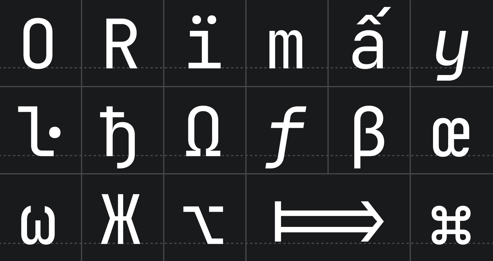
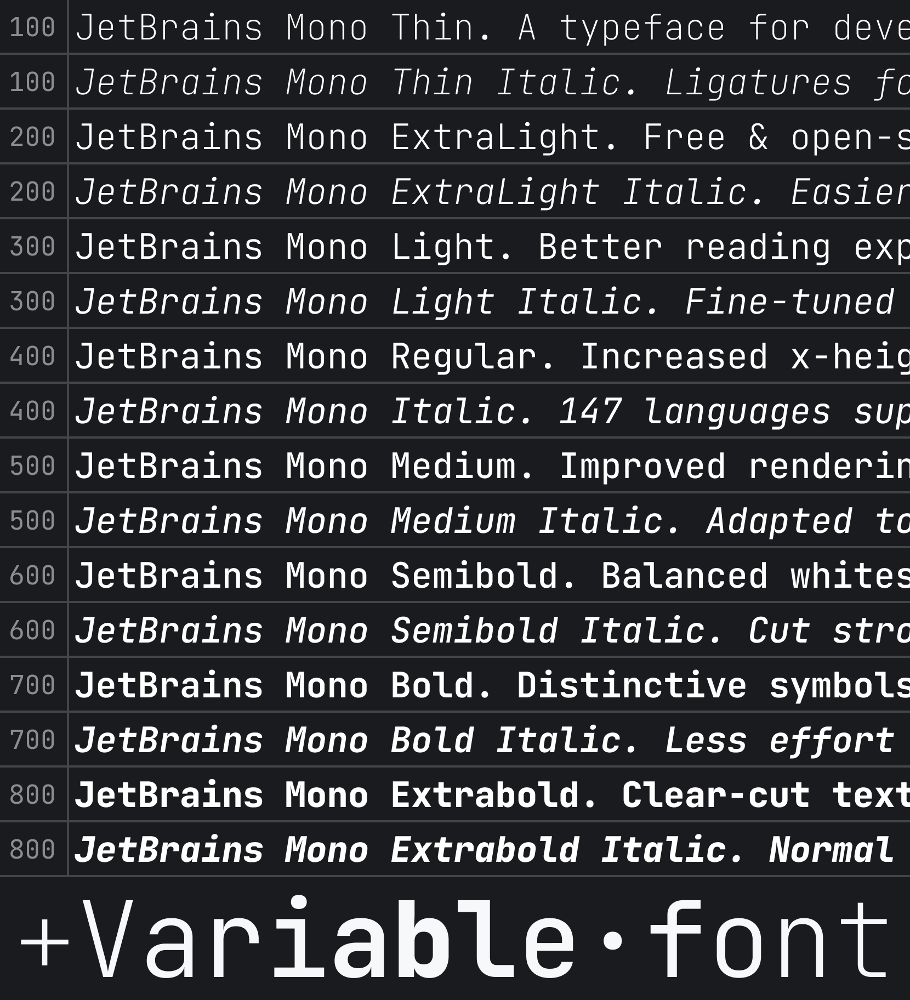
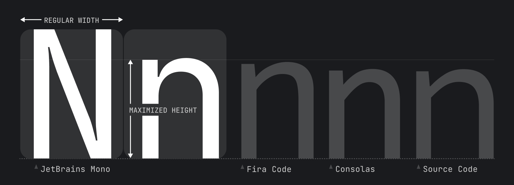
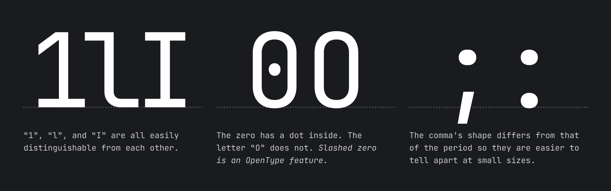
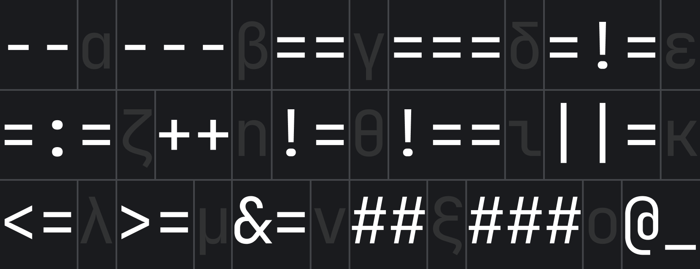
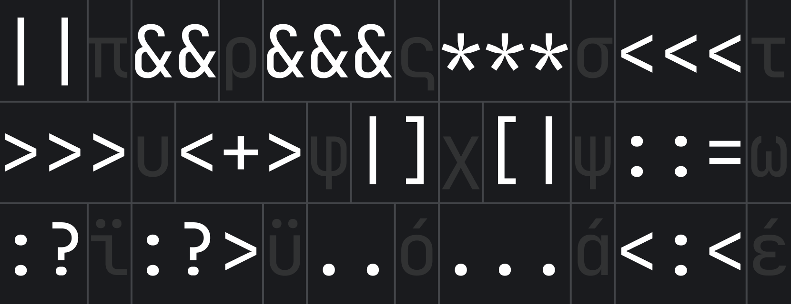
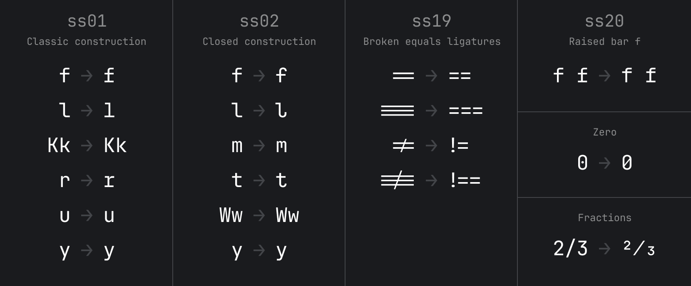
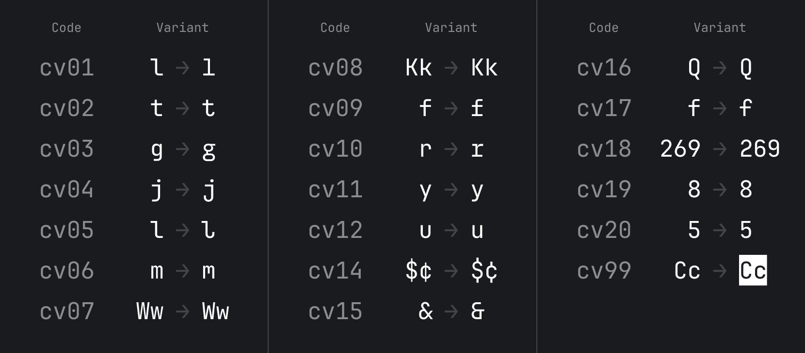
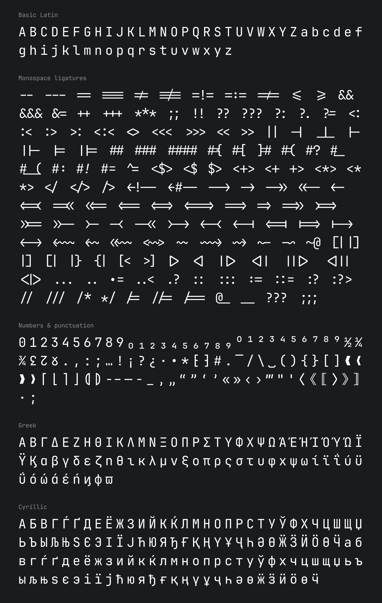

[](https://confluence.jetbrains.com/display/ALL/JetBrains+on+GitHub)

# JetBrains Mono: a typeface made for developers


JetBrains Mono is available as a standalone download, and is also bundled in all JetBrains IDEs. Discover more font features & design on its [web page](https://jetbrains.com/mono/). 

Default version of JetBrains Mono comes with OpenType features and ligatures (which can always be toggled on & off in the settings). If your IDE doesn’t support OpenType, use a special version of the font — [JetBrains Mono NL](https://github.com/JetBrains/JetBrainsMono/tree/master/fonts/ttf), which doesn’t include any ligatures.

# **Installation**

### **JetBrains IDEs**

The most recent version of JetBrains Mono ships with your JetBrains IDE starting with v2019.3.

Select JetBrains Mono in the IDE settings: go to `Preferences/Settings` → `Editor` → `Font`, and then select JetBrains Mono from the **Font** dropdown.

### Brew (macOS only)

Install it using the `font-jetbrains-mono` cask:

```console
brew install --cask font-jetbrains-mono
```

### Manual installation

_On Mac/Windows_: 

1. [Download font](https://github.com/JetBrains/JetBrainsMono/releases/latest). 
2. Unzip the archive and install the font:
   - _Mac_. Select all font files in the folder and double-click them. Click the **Install Font** button.
   - _Windows_. Select all font files in the folder, right-click any of them, then pick **Install** from the menu.

> **Note** If you have previously installed JetBrains Mono, please uninstall all previous versions to exclude conflicts and errors in rendering.

_On Linux_: 

Open a terminal and run the following:

```bash
/bin/bash -c "$(curl -fsSL https://raw.githubusercontent.com/JetBrains/JetBrainsMono/master/install_manual.sh)"
```

Once JetBrains Mono is installed in your OS, you are ready to configure the editor.  


### **Visual Studio Code** 

1. From the **File** menu (**Code** on Mac) go to `Preferences` → `Settings`, or use keyboard shortcut <kbd>Ctrl</kbd>+<kbd>,</kbd> (<kbd>Cmd</kbd>+<kbd>,</kbd> on Mac).
2. In the **Editor: Font Family** input box type `JetBrains Mono`, replacing any content.
3. To enable ligatures, go to **Editor: Font Ligatures**, click **Edit in settings.json**, and copy this line `"editor.fontLigatures": true` into json file.

### **More ways to install**
- [Chocolatey](https://github.com/JetBrains/JetBrainsMono/wiki/Other-ways-to-install#through-chocolatey-windows-only)
- [ChromeOS terminal](https://github.com/JetBrains/JetBrainsMono/wiki/Other-ways-to-install#chromeos-terminal)

## Font Styles
There are 8 font styles available in JetBrains Mono, from Thin to ExtraBold, each coming with its own _italic_ version.



## Font Features

### Increased x-height
While characters remain standard in width, the height of the lowercase is maximized. This approach keeps code lines to the length that developers expect, and it helps improve rendering in small size, since each symbol occupies more pixels.



### Distinctiveness of symbols



## Ligatures for Code
A ligature is a character consisting of two or more joined symbols. Traditionally, it was introduced as a space-saving technique in printed texts. In code, this technique is adopted to show operators and is used mainly for two purposes:
1. To **reduce noise** by merging symbols and removing details so the eyes are processing less:



2. To balance whitespace more efficiently by shifting the glyphs in certain cases:



> **Note** if your IDE doesn’t support OpenType features and ligatures, use [JetBrains Mono NL](https://github.com/JetBrains/JetBrainsMono/tree/master/fonts/ttf) instead.

## OpenType features
Starting from v2.304, JetBrains Mono has added support for alternate characters.
_Stylistic Sets_ `ss01-20` usually change a group of characters. _Character Variant_ `cv01-99` usually changes only one character.
Here are the [instructions for enabling these features.](https://github.com/JetBrains/JetBrainsMono/wiki/OpenType-features)




## Basic Character Set


You can find full JetBrains Mono character set on our [wiki page](https://github.com/JetBrains/JetBrainsMono/wiki/List-of-supported-symbols).

## Building from source files

> **Note** To build from source, you'd need Python 3.9.5 or higher (install instructions for Python [available here](https://wiki.python.org/moin/BeginnersGuide/Download)).

The source files can be found in the *"Source"* folder. To open them you will need Glyphs app.\
To build the `.ttf`, `.otf`, `woff2` & variable `.ttf` you will need to:
- Install **gftools** `pip install gftools`
- Install **fonttools[woff]** `pip install fonttools[woff]`
- Navigate to **JetBrainsMono** folder in Terminal app.
- Type `gftools builder sources/config.yaml` in Terminal and run it.
- Type `python scripts/generate_variable_webfonts.py` in Terminal and run it to generate variable `woff2` files.
- After the scripts are complete, the files can be found in *fonts* folder.

## License

JetBrains Mono typeface is available under the [OFL-1.1 License](https://github.com/JetBrains/JetBrainsMono/blob/master/OFL.txt) and can be used free of charge, for both commercial and non-commercial purposes. You do not need to give credit to JetBrains, although we will appreciate it very much if you do.

The source code is available under [Apache 2.0 License](https://www.apache.org/licenses/LICENSE-2.0)

## Credits

**Type designer**\
Philipp Nurullin

**Team lead**\
Konstantin Bulenkov

**Thanks to**\
Nikita Prokopov\
Eugene Auduchinok\
Tatiana Tulupenko\
Dmitrij Batrak\
IntelliJ Platform UX Team\
Web Team
